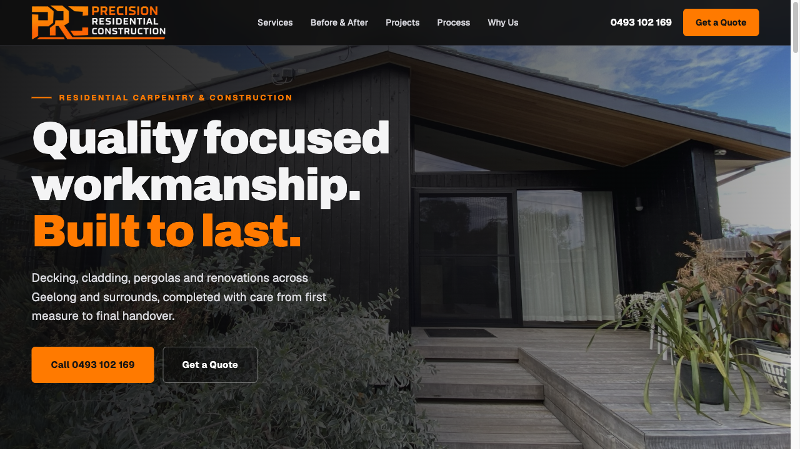
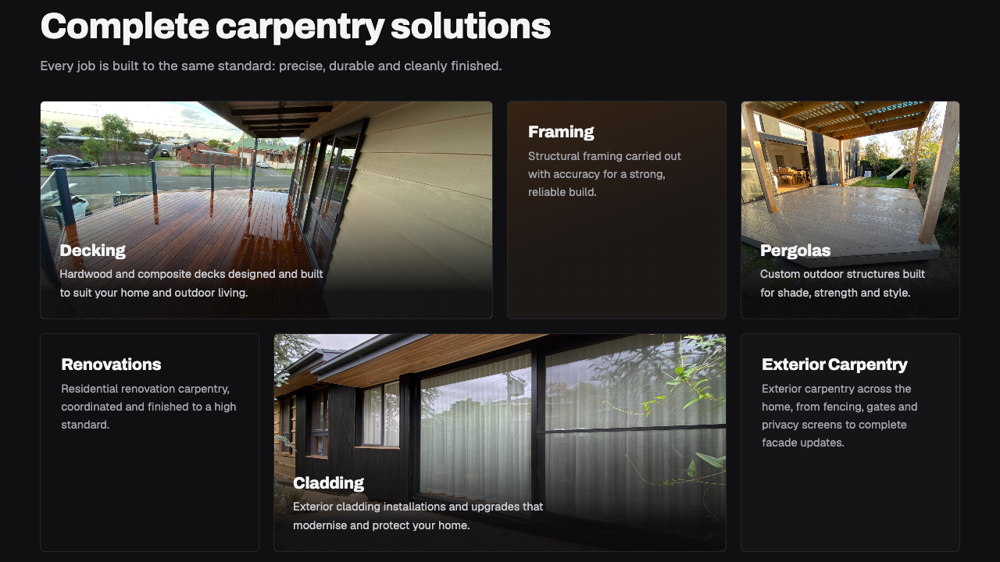
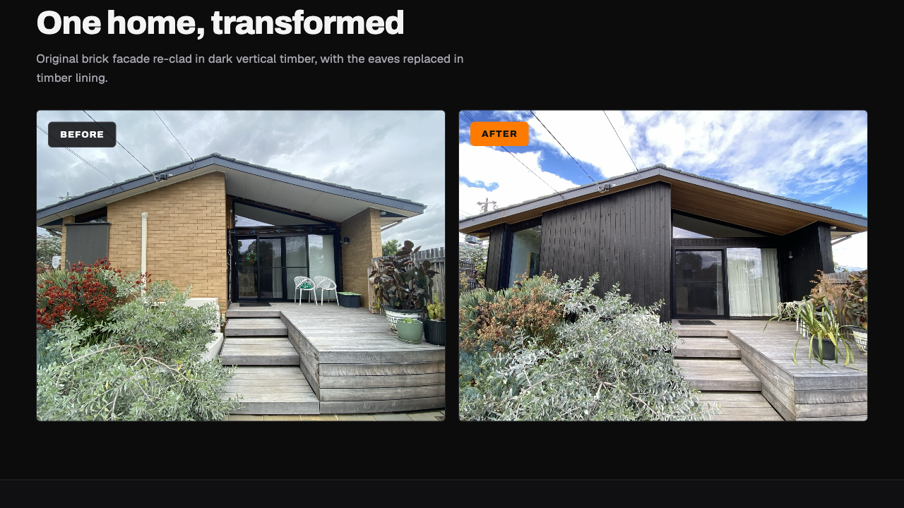
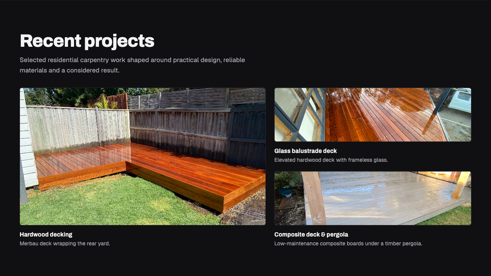
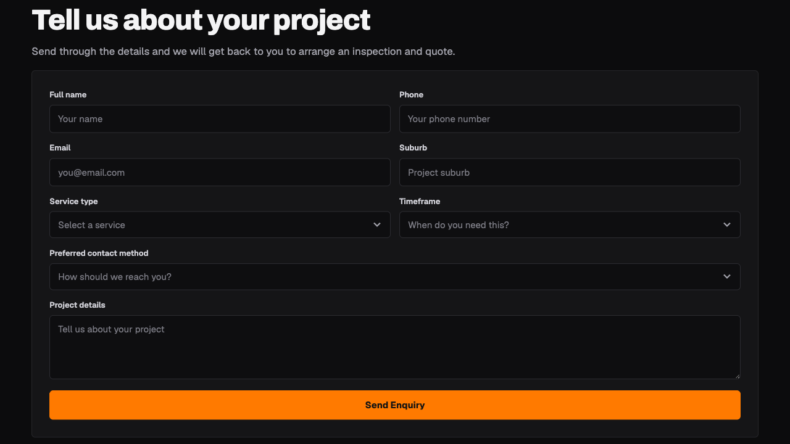

# Precision Residential Construction Website

A customer-facing website for a Geelong residential builder, covering services, completed projects, direct contact and structured quote enquiries.

| | |
| --- | --- |
| Status | Live client website |
| Role | Discovery, content structure, design, implementation and lead capture |
| Stack | HTML, CSS, JavaScript, n8n |
| Live site | [prconstruction.au](https://prconstruction.au/) |
| Project page | [smsystems.au/work/precision-residential-construction](https://smsystems.au/work/precision-residential-construction/) |

## Project brief

Precision Residential Construction needed a credible web presence that made its work easy to inspect and made contacting the builder straightforward on desktop and mobile.

The site leads with completed residential work, then moves through core services, a before-and-after transformation, recent projects and a quote form. Phone and email actions remain available throughout the page.



## Content and interaction design

### Services

Six service areas are presented in plain language: decking, framing, pergolas, renovations, cladding and exterior carpentry.



### Project presentation

The photography is organised around outcomes rather than a generic gallery. A before-and-after comparison shows the exterior change directly, while recent projects carry short contextual descriptions.





### Quote intake

The enquiry form captures the details needed for a useful first response:

- name and contact details;
- project suburb;
- service type;
- expected timeframe;
- preferred contact method;
- project description.

Enquiries are recorded by the form service and delivered to the business owner. A labelled commissioning enquiry reached the owner and received a direct reply.



## Source snapshot

[`site/index.html`](site/index.html) and [`site/assets`](site/assets/) contain the deployed static site snapshot. Contact details and project photography are already public on the live client website and are included with permission.

No private correspondence, invoices, analytics exports or customer enquiry records are included.

## Repository contents

```text
site/       deployed static source snapshot
assets/     selected project screens
docs/       delivery and privacy notes
```

[Delivery notes](docs/delivery.md)
